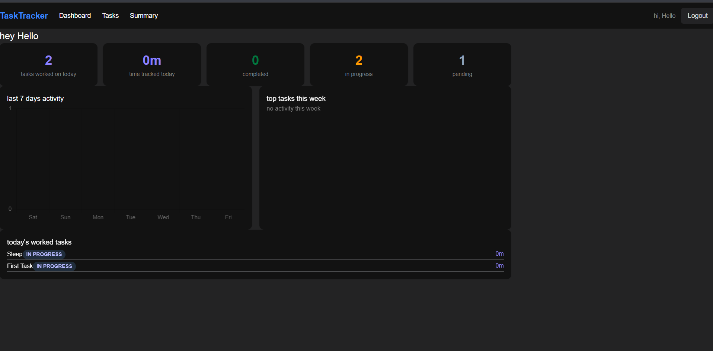
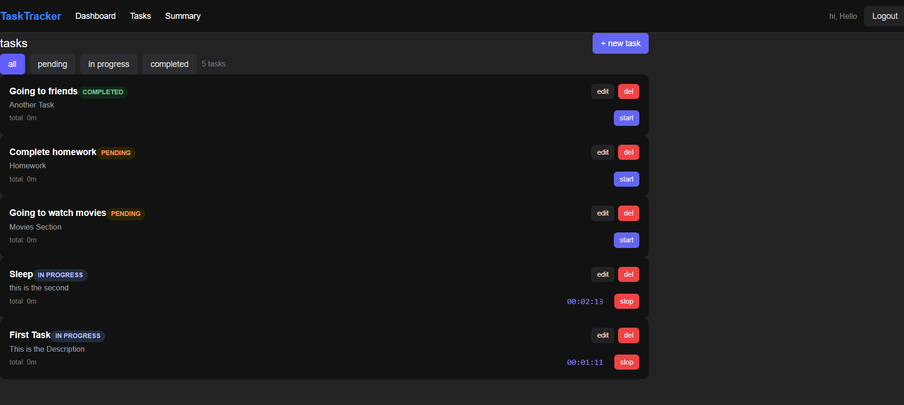
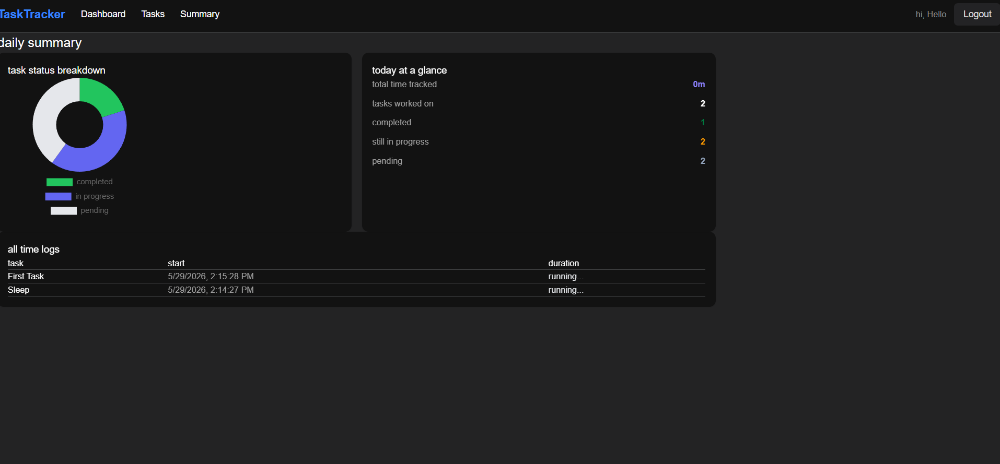
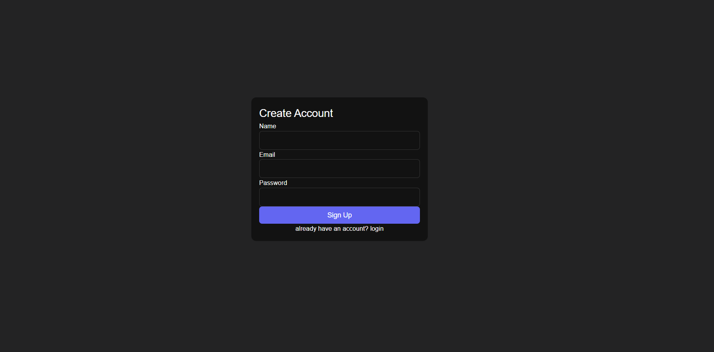

# Task Tracker

A full stack task and time tracking app — create tasks, track time with a real-time timer, and view daily productivity summaries.

**Live Demo:** https://curved-memory-oa-task-track.vercel.app

---

## Setup

### Backend
```bash
cd server
cp .env.example .env      # add your Postgres credentials
npm i
npm run db:push
npm start
```

### Frontend
```bash
cd client
cp .env.example .env
npm i
npm run dev
```

> Make sure you're connected to the internet — the app uses an online database.

---

## Tech Stack

| Backend | Node.js, Express.js, PostgreSQL, Prisma |
| Frontend | React.js, Context API, Tailwind CSS |
| Auth | JWT, bcrypt |

---

## Deployment

| Frontend | https://curved-memory-oa-task-track.vercel.app |
| Backend | https://curved-memory.onrender.com |
| Repo | https://github.com/tech-dipesh/curved_memory_oa_task_track |


## Screenshots





